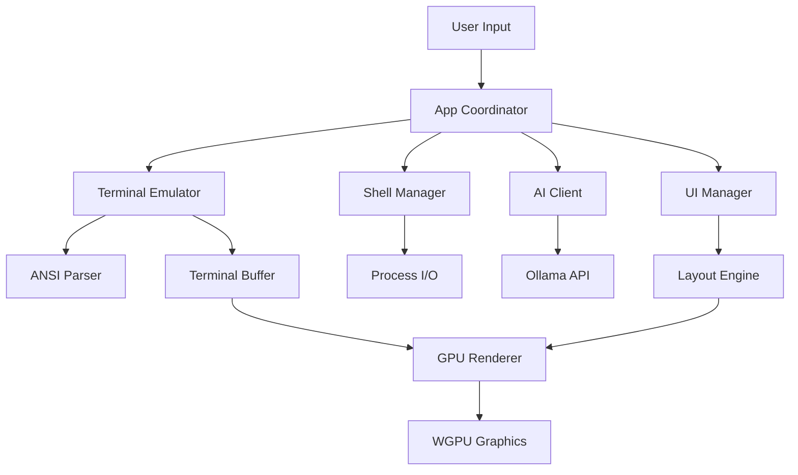

# Liminal Terminal Emulator

A modern, GPU-accelerated terminal emulator built in Rust with integrated local AI assistance. Designed for security-conscious users who want a fast, feature-rich terminal experience without compromising privacy.

[](https://www.rust-lang.org/)
[](LICENSE)

## Features

🚀 **GPU-Accelerated Rendering**: Hardware-accelerated text rendering using WGPU for smooth scrolling and high performance

🧠 **Local AI Integration**: Built-in AI assistant powered by Ollama for command generation, output explanation, and terminal assistance

🔒 **Privacy-First**: Fully offline and airgapped operation - no cloud dependencies or data transmission

⚡ **Modern Architecture**: Built with Rust for memory safety, performance, and reliability

🎨 **Customizable UI**: Modern interface with resizable panels, themes, and flexible layouts

📱 **Cross-Platform**: Supports macOS, Linux, and Windows

## Quick Start

### Prerequisites

- **Rust**: Install from [rustup.rs](https://rustup.rs/)
- **Ollama** (optional, for AI features): Install from [ollama.ai](https://ollama.ai/)

### Installation

1. **Clone the repository**:
   ```bash
   git clone https://github.com/your-username/liminal.git
   cd liminal
   ```

2. **Build the project**:
   ```bash
   cargo build --release
   ```

3. **Run the terminal**:
   ```bash
   cargo run
   ```

### Setting up AI Features

1. **Install Ollama**:
   ```bash
   # macOS
   brew install ollama
   
   # Linux
   curl -fsSL https://ollama.ai/install.sh | sh
   
   # Windows
   # Download from https://ollama.ai/download/windows
   ```

2. **Start Ollama server**:
   ```bash
   ollama serve
   ```

3. **Pull a model**:
   ```bash
   ollama pull llama3.2
   ```

4. **Enable AI in configuration** (optional - enabled by default):
   ```toml
   # ~/.config/liminal/config.toml
   [ai]
   enabled = true
   model_name = "llama3.2"
   ```

## Project Structure

```
liminal/
├── src/
│   ├── main.rs              # Application entry point
│   ├── lib.rs               # Library root
│   ├── app.rs               # Main application coordinator
│   ├── terminal.rs          # Terminal emulation core
│   ├── renderer.rs          # GPU-accelerated renderer
│   ├── shell.rs             # Shell process management
│   ├── ai.rs                # Ollama AI integration
│   ├── ui.rs                # User interface management
│   ├── config.rs            # Configuration management
│   ├── errors.rs            # Error types and handling
│   └── shaders/
│       └── terminal.wgsl    # WGSL shader for text rendering
├── examples/
│   └── ollama_integration.rs # AI integration example
├── docs/
│   └── architecture.md      # Detailed architecture documentation
├── assets/
│   └── fonts/               # Font files
├── Cargo.toml               # Rust dependencies and metadata
└── README.md                # This file
```

## Core Modules

### 1. Terminal Emulator (`terminal.rs`)
- ANSI escape sequence parsing using VTE
- Terminal buffer management with scrollback
- Color and styling support
- Cursor movement and operations

### 2. GPU Renderer (`renderer.rs`)
- WGPU-based hardware acceleration
- Efficient text rendering with font caching
- UI element rendering (panels, popups, buttons)
- Cross-platform graphics support

### 3. Shell Manager (`shell.rs`)
- Cross-platform shell process management
- Asynchronous I/O handling
- Environment variable management
- Process lifecycle control

### 4. AI Integration (`ai.rs`)
- Ollama HTTP API client
- Multiple AI interaction modes:
  - Command generation from natural language
  - Terminal output explanation
  - General shell assistance
- Automatic Ollama setup and model management

### 5. UI Manager (`ui.rs`)
- Flexible layout system
- Event handling and user interactions
- Panel management (terminal, AI, status bar)
- Popup and modal support

## Configuration

Liminal uses a TOML configuration file located at `~/.config/liminal/config.toml`:

```toml
[terminal]
rows = 24
cols = 80
scrollback_limit = 10000
font_family = "JetBrains Mono"
font_size = 14.0

[renderer]
vsync = true
gpu_acceleration = true
background_color = [0.1, 0.1, 0.1, 1.0]  # Dark gray
text_color = [0.9, 0.9, 0.9, 1.0]        # Light gray

[ai]
ollama_base_url = "http://localhost:11434"
model_name = "llama3.2"
context_length = 4096
temperature = 0.7
enabled = true

[shell]
shell_command = "/bin/zsh"  # Auto-detected if not specified
working_directory = "/Users/username"
environment_variables = { "TERM" = "xterm-256color" }
```

## Usage Examples

### Basic Terminal Usage

The terminal functions like any standard terminal emulator:
- Type commands and see output
- Use keyboard shortcuts (Ctrl+C, Ctrl+D, etc.)
- Scroll through history
- Copy and paste text

### AI Assistant Features

1. **Generate commands from natural language**:
   - Press a hotkey (e.g., Ctrl+Space) to open AI panel
   - Type: "list all files larger than 100MB"
   - AI suggests: `find . -type f -size +100M -ls`

2. **Explain command output**:
   - Run a command with complex output
   - Ask AI to explain what the output means
   - Get detailed explanations of error messages

3. **Terminal assistance**:
   - Ask questions about shell commands
   - Get help with system administration tasks
   - Learn about command-line tools

### Running Examples

Test the AI integration:
```bash
cargo run --example ollama_integration
```

## Architecture Overview



## Data Flow

1. **User Input**: Keyboard/mouse events captured by Winit
2. **Event Processing**: App coordinator routes events to appropriate modules
3. **Shell Communication**: Commands sent to shell process, output received
4. **Terminal Processing**: ANSI sequences parsed and applied to terminal buffer
5. **AI Processing**: User queries sent to local Ollama instance
6. **Rendering**: GPU-accelerated rendering of terminal content and UI elements

## Development

### Building from Source

```bash
# Debug build
cargo build

# Release build (optimized)
cargo build --release

# Run with logging
RUST_LOG=debug cargo run
```

### Running Tests

```bash
# Run all tests
cargo test

# Run with output
cargo test -- --nocapture
```

### Code Structure Guidelines

- **Error Handling**: Use the custom `Result<T>` type from `errors.rs`
- **Async Operations**: Use `tokio` for all async operations
- **Configuration**: Access config through the centralized `Config` struct
- **Logging**: Use the `log` crate with appropriate levels

## Performance

### Benchmarks

Liminal is designed for high performance:
- **Text Rendering**: GPU-accelerated with font caching
- **Terminal Processing**: Efficient ANSI parsing with VTE
- **Memory Usage**: Optimized buffer management
- **Startup Time**: Fast initialization with lazy loading

### Optimization Features

- Zero-copy operations where possible
- Efficient scrollback buffer management
- GPU memory optimization
- Background task scheduling

## Security & Privacy

### Security Features

- **Process Isolation**: Shell processes run in controlled environment
- **No Network Dependencies**: Core functionality works offline
- **Local AI**: All AI processing happens locally via Ollama
- **Secure Defaults**: Conservative configuration out of the box

### Privacy Guarantees

- **No Telemetry**: No usage data collection
- **No Cloud Services**: All processing happens locally
- **No Data Transmission**: Terminal content never leaves your machine
- **Audit-Friendly**: Open source code for security review

## Contributing

We welcome contributions! Please see our contributing guidelines:

1. Fork the repository
2. Create a feature branch
3. Make your changes
4. Add tests for new functionality
5. Submit a pull request

### Areas for Contribution

- **Platform Support**: Help with Windows/Linux specific features
- **Themes**: Create new visual themes and customization options
- **Performance**: Optimize rendering and memory usage
- **Features**: Add new terminal emulation features
- **Documentation**: Improve docs and examples

## License

This project is licensed under either of

- Apache License, Version 2.0, ([LICENSE-APACHE](LICENSE-APACHE) or http://www.apache.org/licenses/LICENSE-2.0)
- MIT license ([LICENSE-MIT](LICENSE-MIT) or http://opensource.org/licenses/MIT)

at your option.

## Acknowledgments

- [VTE](https://github.com/alacritty/vte) for ANSI parsing
- [WGPU](https://github.com/gfx-rs/wgpu) for GPU acceleration
- [Ollama](https://ollama.ai/) for local AI capabilities
- [Winit](https://github.com/rust-windowing/winit) for cross-platform windowing
- The Rust community for excellent crates and tools

## FAQ

**Q: Why another terminal emulator?**
A: Liminal focuses on privacy, security, and AI integration while maintaining high performance through GPU acceleration.

**Q: Does this require an internet connection?**
A: No, Liminal is designed to work completely offline. The AI features use local Ollama models.

**Q: What's the performance compared to other terminals?**
A: GPU acceleration provides smooth scrolling and fast rendering, especially with large amounts of text.

**Q: Can I use my existing shell configuration?**
A: Yes, Liminal works with your existing shell (bash, zsh, fish, etc.) and respects your configuration.

**Q: Is this ready for daily use?**
A: This is a modern implementation with all core terminal features. Test it with your workflow to see if it meets your needs.

---

For more detailed information, see [docs/architecture.md](docs/architecture.md). 