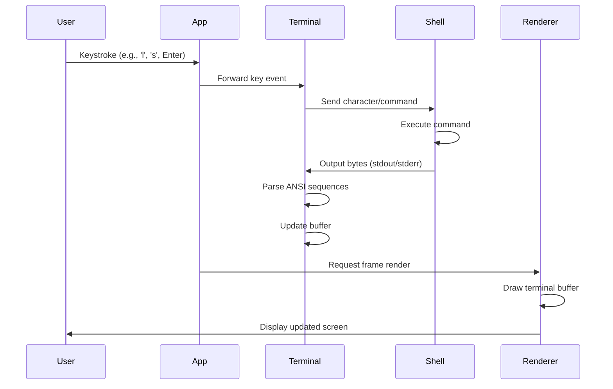
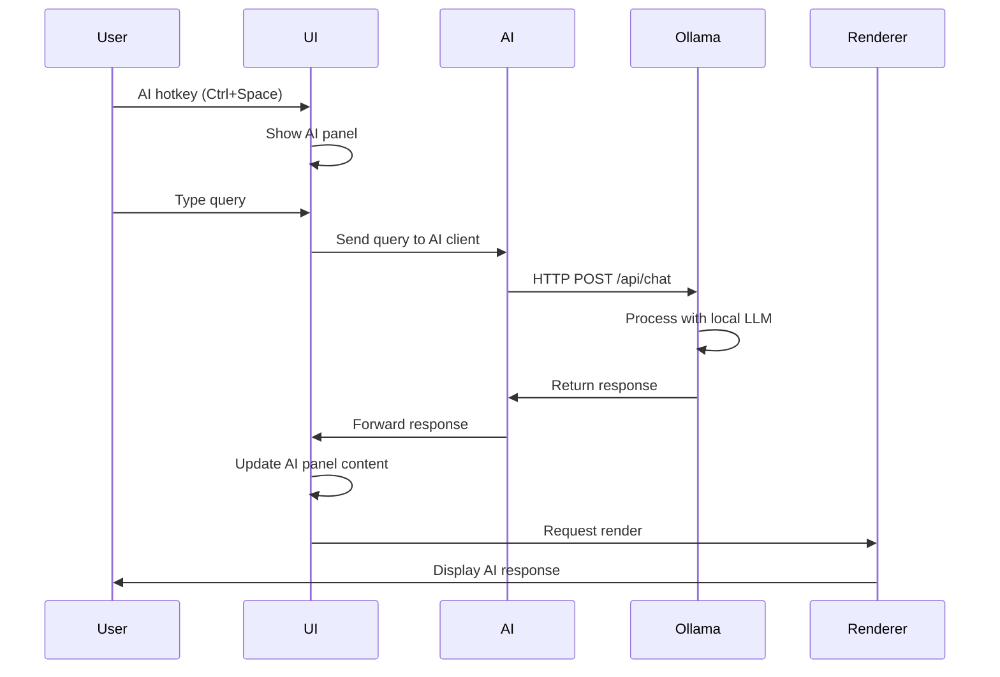
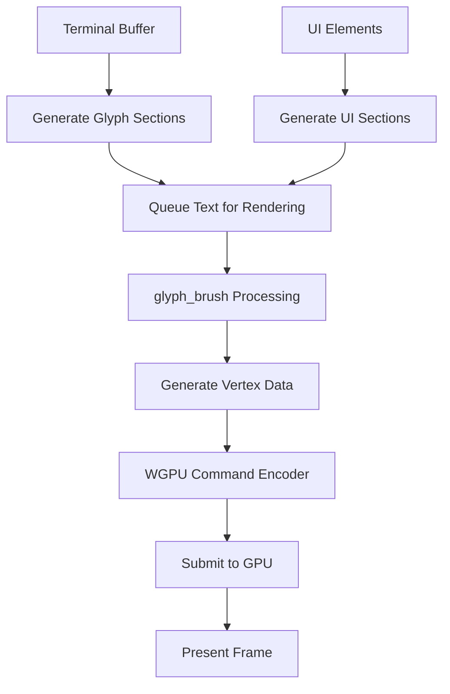

# Liminal Terminal Emulator - Data Flow Documentation

## Overview

This document details how data flows through the Liminal terminal emulator, from user input to screen rendering, including AI integration points.

## High-Level Data Flow

```
┌─────────────┐    ┌─────────────┐    ┌─────────────┐
│    User     │    │    Shell    │    │ Ollama AI   │
│   Input     │    │   Process   │    │   Server    │
└─────┬───────┘    └─────┬───────┘    └─────┬───────┘
      │                  │                  │
      ▼                  ▼                  ▼
┌─────────────────────────────────────────────────────┐
│              Application Layer                      │
│  ┌───────────┐ ┌───────────┐ ┌───────────────────┐  │
│  │    App    │ │ Terminal  │ │   AI Client       │  │
│  │Coordinator│ │ Emulator  │ │                   │  │
│  └─────┬─────┘ └─────┬─────┘ └─────┬─────────────┘  │
└────────┼─────────────┼─────────────┼────────────────┘
         │             │             │
         ▼             ▼             ▼
┌─────────────────────────────────────────────────────┐
│              Rendering Layer                        │
│  ┌───────────┐ ┌───────────┐ ┌───────────────────┐  │
│  │    UI     │ │   WGPU    │ │    Window         │  │
│  │ Manager   │ │ Renderer  │ │   Manager         │  │
│  └───────────┘ └───────────┘ └───────────────────┘  │
└─────────────────────────────────────────────────────┘
```

## Detailed Data Flow Scenarios

### 1. Terminal Command Execution



#### Data Transformations:

1. **User Input**: Raw keyboard events from Winit
   ```rust
   WindowEvent::KeyboardInput { 
       input: KeyboardInput { 
           virtual_keycode: Some(VirtualKeyCode::L),
           state: ElementState::Pressed,
           .. 
       } 
   }
   ```

2. **Terminal Processing**: Convert to shell input
   ```rust
   let bytes = match key {
       VirtualKeyCode::L => b"l",
       VirtualKeyCode::Return => b"\n",
       // ... other keys
   };
   shell_manager.send_input(bytes).await?;
   ```

3. **Shell Output**: Raw bytes with ANSI sequences
   ```
   b"\x1b[0;32muser@host\x1b[0m:\x1b[0;34m~/Documents\x1b[0m$ ls\n"
   b"file1.txt  file2.rs  directory/\n"
   ```

4. **ANSI Parsing**: Convert to terminal operations
   ```rust
   // VTE parser converts sequences to actions
   // \x1b[0;32m -> Set foreground color to green
   // \x1b[0m -> Reset attributes
   terminal.process_data(&output_bytes);
   ```

5. **Buffer Update**: Update terminal grid
   ```rust
   buffer.set_cell(row, col, TerminalCell {
       character: 'l',
       foreground_color: RGB8::new(0, 255, 0), // Green
       background_color: RGB8::new(0, 0, 0),   // Black
       bold: false,
       italic: false,
       underline: false,
   });
   ```

### 2. AI Query Processing



#### AI Request Flow:

1. **User Query**: Natural language input
   ```
   "List all files larger than 100MB in the current directory"
   ```

2. **API Request**: Structured request to Ollama
   ```rust
   let request = ChatRequest {
       model: "llama3.2".to_string(),
       messages: vec![
           ChatMessage {
               role: "system".to_string(),
               content: "Generate shell commands from descriptions.".to_string(),
           },
           ChatMessage {
               role: "user".to_string(),
               content: "List all files larger than 100MB".to_string(),
           },
       ],
       stream: false,
       options: ChatOptions {
           temperature: 0.7,
           num_ctx: 4096,
       },
   };
   ```

3. **HTTP Transport**: JSON over HTTP
   ```json
   POST http://localhost:11434/api/chat
   {
     "model": "llama3.2",
     "messages": [...],
     "stream": false,
     "options": {...}
   }
   ```

4. **AI Response**: Generated command
   ```json
   {
     "model": "llama3.2",
     "created_at": "2024-01-01T12:00:00Z",
     "message": {
       "role": "assistant",
       "content": "find . -type f -size +100M -ls"
     },
     "done": true
   }
   ```

5. **UI Display**: Show in AI panel
   ```rust
   ui_manager.show_ai_response(format!(
       "Command suggestion:\n{}\n\nPress Enter to execute.",
       response.message.content
   ));
   ```

### 3. GPU Rendering Pipeline



#### Rendering Data Flow:

1. **Terminal Buffer**: 2D grid of styled characters
   ```rust
   // 80x24 grid of TerminalCell
   let buffer: Vec<Vec<TerminalCell>> = terminal.get_buffer();
   ```

2. **Glyph Section Generation**: Convert to renderable sections
   ```rust
   for (row_idx, row) in buffer.iter().enumerate() {
       for (col_idx, cell) in row.iter().enumerate() {
           if cell.character != ' ' {
               let x = col_idx as f32 * char_width;
               let y = row_idx as f32 * line_height;
               
               sections.push(Section {
                   screen_position: (x, y),
                   text: vec![Text::new(&cell.character.to_string())
                       .with_color([
                           cell.foreground_color.r as f32 / 255.0,
                           cell.foreground_color.g as f32 / 255.0,
                           cell.foreground_color.b as f32 / 255.0,
                           1.0,
                       ])],
                   ..Section::default()
               });
           }
       }
   }
   ```

3. **GPU Command Generation**: WGPU commands
   ```rust
   let mut encoder = device.create_command_encoder(&CommandEncoderDescriptor {
       label: Some("Render Encoder"),
   });
   
   // Clear background
   let mut render_pass = encoder.begin_render_pass(&RenderPassDescriptor {
       color_attachments: &[Some(RenderPassColorAttachment {
           view: &view,
           ops: Operations {
               load: LoadOp::Clear(clear_color),
               store: StoreOp::Store,
           },
           ..
       })],
       ..
   });
   
   // Render text
   glyph_brush.draw_queued(&device, &mut staging_belt, &mut encoder, &view, width, height)?;
   ```

4. **Frame Presentation**: Display to screen
   ```rust
   queue.submit(std::iter::once(encoder.finish()));
   output.present();
   ```

## Performance Optimizations

### 1. Efficient Buffer Management

- **Dirty Tracking**: Only re-render changed cells
- **Scrollback Optimization**: Circular buffer for history
- **Memory Pooling**: Reuse allocations for frequent operations

### 2. GPU Optimizations

- **Batch Rendering**: Group similar operations
- **Font Atlases**: Cache glyph textures
- **Vertex Buffer Reuse**: Minimize GPU memory allocation

### 3. Async Processing

- **Non-blocking I/O**: Shell communication doesn't block UI
- **Background Tasks**: AI requests processed asynchronously
- **Frame Pacing**: Maintain consistent frame rates

## Error Handling and Recovery

### 1. Shell Process Errors

```rust
match shell_manager.receive_output().await {
    Some(ShellEvent::Output(data)) => terminal.process_data(&data),
    Some(ShellEvent::Error(err)) => log::error!("Shell error: {}", err),
    Some(ShellEvent::Exit(code)) => {
        if code != 0 {
            log::warn!("Shell exited with code: {}", code);
        }
        // Restart shell or handle exit
    },
    None => {
        // Channel closed, shell may have died
        log::error!("Shell communication lost");
    }
}
```

### 2. AI Service Errors

```rust
match ai_client.chat(messages).await {
    Ok(response) => ui_manager.show_ai_response(response),
    Err(LiminalError::Ai(msg)) => {
        ui_manager.show_popup(
            "ai_error".to_string(),
            "AI Error".to_string(),
            format!("Failed to get AI response: {}", msg),
        );
    },
    Err(e) => log::error!("Unexpected AI error: {}", e),
}
```

### 3. Rendering Errors

```rust
match renderer.render(&terminal, &ui_manager).await {
    Ok(()) => {
        // Successful frame
        frame_count += 1;
    },
    Err(LiminalError::Renderer(msg)) => {
        log::error!("Render error: {}", msg);
        // Attempt recovery or fallback rendering
    },
    Err(e) => {
        log::error!("Critical render error: {}", e);
        // May need to recreate renderer
    }
}
```

## Configuration Flow

Configuration affects all components and follows this flow:

1. **Load**: Config loaded from `~/.config/liminal/config.toml`
2. **Validation**: Check for valid values and provide defaults
3. **Distribution**: Pass config sections to relevant components
4. **Runtime Updates**: Some settings can be changed without restart

```rust
// Configuration distribution
let config = Config::load().await?;

let terminal = Terminal::new(&config.terminal)?;
let renderer = Renderer::new(window, &config.renderer).await?;
let ai_client = OllamaClient::new(&config.ai).await?;
let shell_manager = ShellManager::with_config(&config.shell)?;
```

This modular approach ensures each component only receives the configuration it needs while maintaining type safety and validation. 